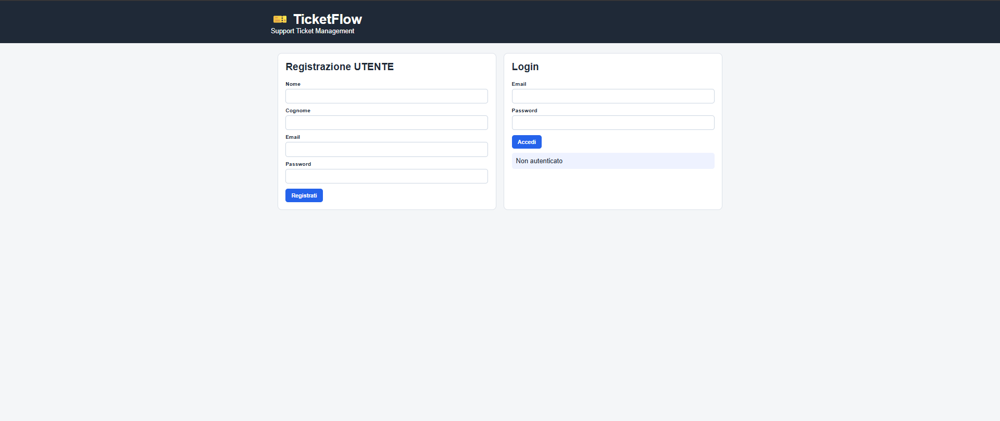
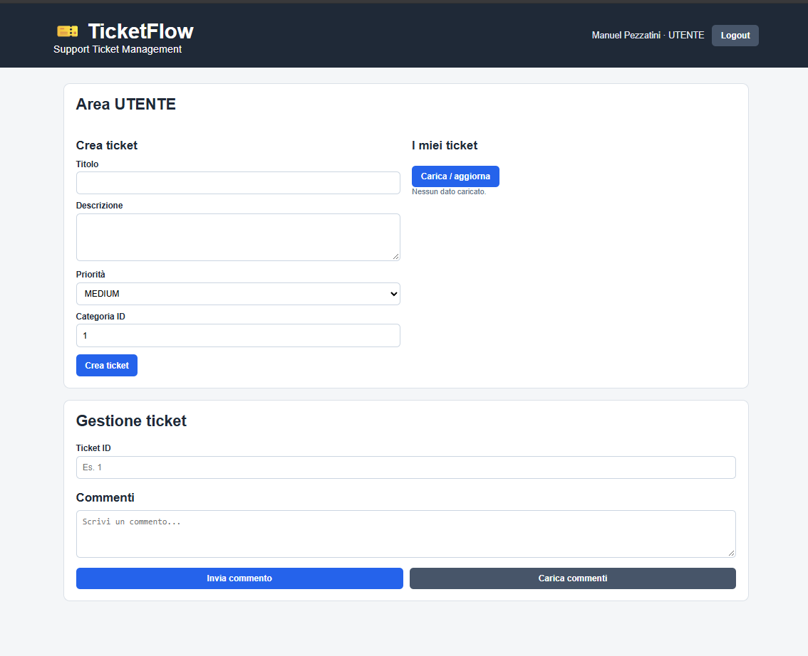
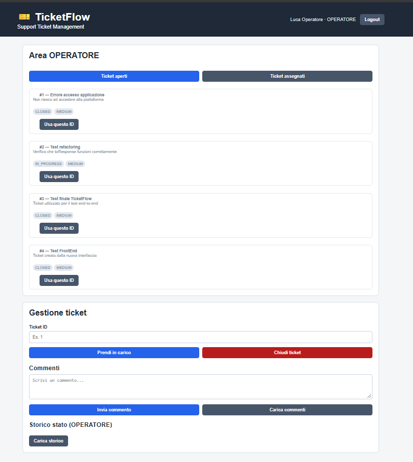
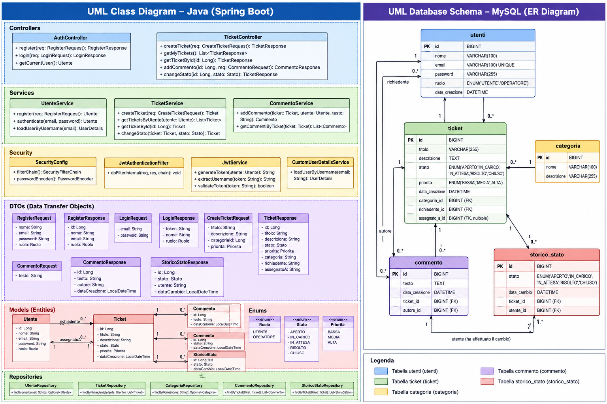

# 🎫 TicketFlow

TicketFlow è una REST API per la gestione di ticket di assistenza, sviluppata con **Java 21 e Spring Boot** come progetto personale backend.

L'applicazione permette a un utente di registrarsi, autenticarsi tramite JWT, creare ticket e commentarli. Gli operatori possono visualizzare i ticket aperti, prenderli in carico, interagire tramite commenti, chiuderli e consultarne lo storico degli stati.

È inclusa anche una UI HTML/JavaScript minimale in `src/main/resources/static/ticketflow-ui-completo.html`, usata per testare il flusso completo frontend → API → database.

## Funzionalità

- Registrazione e login
- Password cifrate con BCrypt
- Autenticazione stateless tramite JWT
- Autorizzazione per ruoli `UTENTE` e `OPERATORE`
- Creazione e gestione ticket
- Priorità `LOW`, `MEDIUM`, `HIGH`
- Workflow `OPEN → IN_PROGRESS → CLOSED`
- Assegnazione del ticket all'operatore autenticato
- Commenti con controllo di accesso al ticket
- Storico dei cambi di stato
- Validazione degli input con Jakarta Validation
- Gestione centralizzata delle eccezioni
- Transazioni per operazioni ticket + storico
- Persistenza MySQL tramite Spring Data JPA / Hibernate
- CORS per UI locale di test

> Il ruolo `ADMIN` è già presente nel modello, ma le funzionalità amministrative non fanno parte della v1.

## User Interface

TicketFlow includes a lightweight frontend integrated with the Spring Boot application to demonstrate the complete ticket management workflow.

### Authentication

Users can register a new account or authenticate using their credentials.
Authentication is handled by Spring Security using JWT.



### User Dashboard

Authenticated users can:

- create new support tickets;
- select a priority and category;
- view their submitted tickets;
- add and read comments related to their tickets.



### Operator Dashboard

Operators have a dedicated interface where they can:

- view open tickets;
- view tickets assigned to them;
- take ownership of an open ticket;
- close tickets currently in progress;
- communicate with users through comments;
- inspect the status history of a ticket.



## Architecture

TicketFlow follows a layered Spring Boot architecture based on controllers, services, repositories and JPA entities.

The project uses MySQL for persistence and Spring Security with JWT for stateless authentication and role-based authorization.



## Stack

- Java 21
- Spring Boot 4.1.1
- Spring Web MVC
- Spring Security
- Spring Data JPA / Hibernate
- MySQL
- JWT (JJWT 0.12.6)
- BCrypt
- Jakarta Validation
- Lombok
- Maven
- HTML / CSS / JavaScript per la UI di test

## Architettura

```text
Controller
    ↓
Service
    ↓
Repository
    ↓
JPA / Hibernate
    ↓
MySQL
```

Package principali:

```text
com.manuel.ticketflow
├── config
├── controllers
├── dto
├── enums
├── exceptions
├── models
├── repositories
├── security
└── services
```

Il progetto usa DTO dedicati per separare il modello persistente dai dati esposti dalle API.

## Sicurezza

Il login viene gestito da Spring Security. Dopo l'autenticazione il backend genera un JWT con l'email dell'utente come subject.

Per le rotte protette il client invia:

```http
Authorization: Bearer <token>
```

`JwtAuthenticationFilter` valida il token e inserisce l'utente autenticato nel `SecurityContext`. L'identità dell'autore o dell'operatore non viene accettata dal frontend: viene ricavata dall'utente autenticato.

Password database e chiave JWT non sono salvate nel repository. Vengono lette da variabili d'ambiente.

## Database

Lo schema SQL necessario è disponibile in [`docs/schema.sql`](docs/schema.sql).

Principali entità:

- `Utente`
- `Categoria`
- `Ticket`
- `Commento`
- `StoricoStato`

Il progetto usa `spring.jpa.hibernate.ddl-auto=validate`: Hibernate verifica che lo schema esista e sia compatibile, senza crearlo automaticamente.

## Avvio locale

### 1. Requisiti

- JDK 21
- MySQL
- Maven oppure Maven Wrapper incluso nel progetto

### 2. Crea il database

Esegui:

```text
docs/schema.sql
```

su MySQL.

### 3. Configura le variabili d'ambiente

Usa `.env.example` come riferimento. Le variabili richieste sono:

```text
DB_URL=jdbc:mysql://localhost:3306/ticket_flow
DB_USERNAME=root
DB_PASSWORD=...
JWT_SECRET=...
```

`JWT_SECRET` deve essere una stringa lunga e casuale (almeno 32 byte per questa configurazione HMAC).

### 4. Avvia l'applicazione

Linux/macOS:

```bash
./mvnw spring-boot:run
```

Windows PowerShell/CMD:

```text
mvnw.cmd spring-boot:run
```

Il backend sarà disponibile su `http://localhost:8080`.

## UI di test

La UI si trova in:

```text
src/main/resources/static/ticketflow-ui-completo.html
```

Con Spring Boot avviato può essere raggiunta direttamente come risorsa statica; in alternativa può essere servita tramite Live Server. La configurazione CORS presente nel progetto consente l'origine locale `http://127.0.0.1:5500`.

## API

La documentazione degli endpoint e alcuni esempi JSON sono disponibili in [`docs/API.md`](docs/API.md).

Flusso principale:

```text
UTENTE
register → login → create ticket → view own tickets → comments

OPERATORE
login → open tickets → take ticket → comments → close → history
```

## Gestione errori e validazione

Il progetto usa `@Valid` e Jakarta Validation sui DTO. Un `@ControllerAdvice` centralizza la gestione degli errori applicativi, inclusi input non validi, JSON non leggibile, risorse mancanti e operazioni vietate.

## Diagrammi

Nel repository sono inclusi i diagrammi Draw.io del progetto e del database:

- `TicketFlowProject_concept.drawio`
- `TicketFlowDB_concept.drawio`

## Possibili sviluppi futuri

- Funzionalità ADMIN e gestione categorie
- Test unitari e di integrazione più completi con JUnit / Mockito
- Gestione più completa di token JWT scaduti o non validi
- Refresh token e logout/revoca token
- Documentazione OpenAPI / Swagger
- Docker
- Dashboard e statistiche
- Protezione da concorrenza nella presa in carico dello stesso ticket

## Obiettivo del progetto

TicketFlow è nato per consolidare competenze backend Java/Spring attraverso un caso d'uso completo: modellazione relazionale, REST API, autenticazione, autorizzazione, business logic, persistenza, validazione, gestione degli errori e integrazione con un client.
